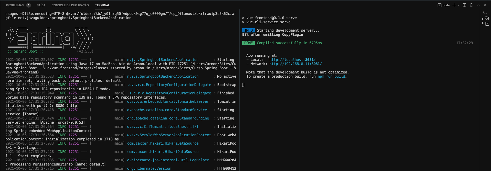

# Spring Boot + Vue
## Front-End + Back-End

## Project setup
Run back-end at:
> src/main/java/net/javaguides/springboot/SpringbootBackendApplication.java

Run front-end at the terminal:
```
npm install
npm run serve
```
